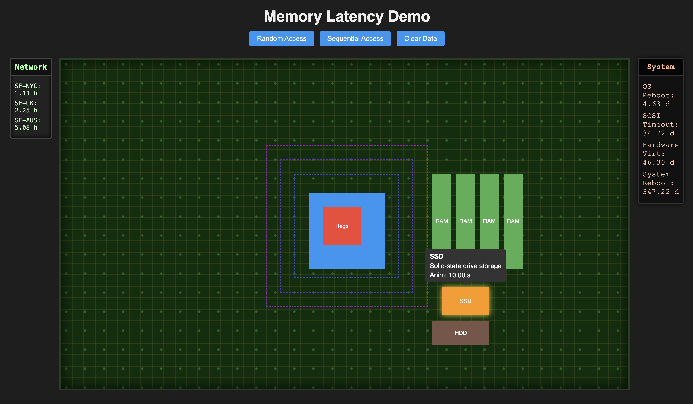

# Memory Latency Demo

An **interactive, web‑based simulation** that visualizes the relative latencies of different memory/storage media—from CPU registers all the way out to network and reboot times—laid out on a motherboard‑style diagram.



---

## 🚀 Live Demo

👉 [https://antonioCoppe.github.io/memory-latency-demo/](https://antonioCoppe.github.io/memory-latency-demo/)

Published via GitHub Pages

---

## 🔍 Project Overview

* **Goal:** Help developers and students grasp the enormous performance gap between CPU cycles, multiple cache levels, main memory, SSD/HDD, network distances, and system reboot times.
* **Visualization:** Clickable memory nodes (Regs, L1, L2, L3, RAM, SSD, HDD, SF→NYC, SF→UK, SF→AUS, OS reboot, SCSI timeout, hardware virtualization reboot, physical system reboot) that spawn an animated packet traveling back to the CPU socket in proportionally accurate (log‑scaled) durations.
* **Motherboard Layout:** Nodes are positioned roughly where you’d find them on a modern PC motherboard, reinforcing spatial intuition.

---

## ✨ Features

1. **Interactive Memory Nodes**
   Click any node to fire a packet that animates to the CPU with realistic timing.

2. **Real‑World Latency Scaling**
   Log‑scale mapping of nanoseconds → milliseconds → seconds → minutes → years, covering 0.3 ns to 5 minutes.

3. **Configurable & Extendable**
   Easily swap in new latency values or add more nodes (e.g., GPU memory, NVMe, cloud storage).

4. **Responsive UI & Themes**
   Supports light/dark mode, mobile/touch interactions, and ARIA‑friendly labels.

5. **Documentation & Guided Tour**
   In‑app tutorial via Shepherd.js walks new users through each memory level.

6. **Live Charts & Stats** *(future)*
   Hit/miss counters and Chart.js plots illustrate access patterns in real time.

---

## 🛠️ Tech Stack

* **Framework:** React + TypeScript
* **Bundler:** Vite
* **Styling:** CSS Modules (with a light/dark theme toggle)
* **Visualization:** Web Animations API
* **Charts:** Chart.js & react‑chartjs‑2
* **Tour:** Shepherd.js
* **Testing:** Jest & React Testing Library
* **CI/CD:** GitHub Actions (lint, test, deploy)
* **Hosting:** GitHub Pages (via `gh-pages`)

---

## 📦 Getting Started

### Prerequisites

* Node.js (>= 16.x)
* npm (>= 8.x)

### Local Setup

```bash
# 1. Clone the repo
git clone https://github.com/AntonioCoppe/memory-latency-demo.git
cd memory-latency-demo

# 2. Install dependencies
npm install

# 3. Run locally
npm run dev
```

Open your browser at `http://localhost:5173/` and explore!

### Testing

```bash
npm run test
```

### Build & Deploy

```bash
# Build for production
npm run build

# Deploy to GitHub Pages
npm run deploy
```

Your changes will be live at `https://antonioCoppe.github.io/memory-latency-demo/` shortly.

---

## 🤝 Contributing

1. Fork the repository
2. Create a feature branch: `git checkout -b feat/my-feature`
3. Commit your changes: `git commit -m "feat: my new feature"`
4. Push to your branch: `git push origin feat/my-feature`
5. Open a Pull Request and describe your enhancement.

Please ensure code is linted (`npm run lint`) and tested.

---

## 📄 License

This project is open‑source under the [MIT License](LICENSE).
